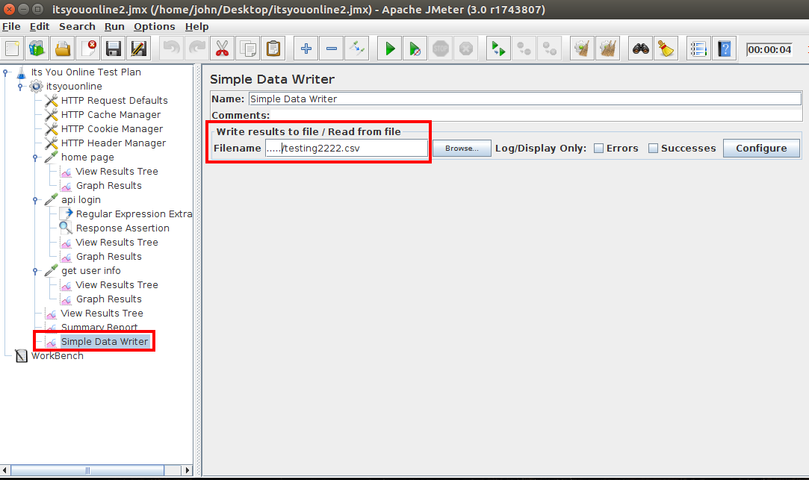
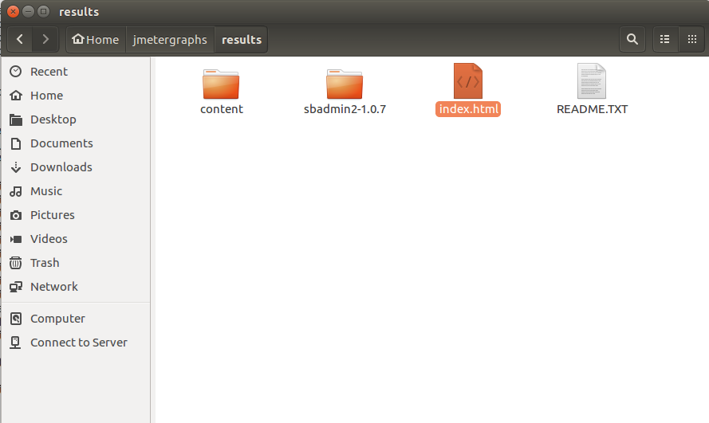
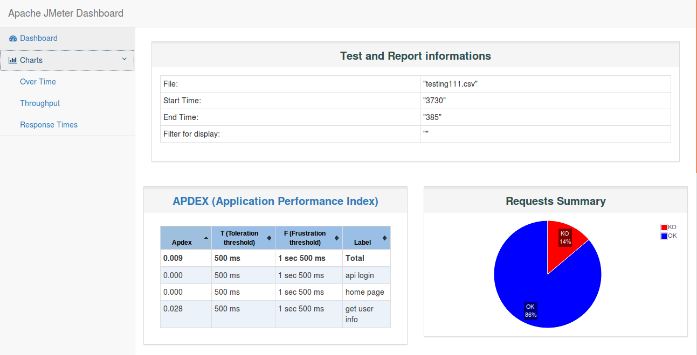

**Jmeter provides a nice report that can be generated to view performance metrics explained [here](Performance_Objectives.md)**
## To be able to generate jmeter report-generator :

Template example to be used: Itsyouonline2.jmx

1- Make sure that you have the latest jmeter binaries from here: http://jmeter.apache.org/download_jmeter.cgi
   (For Now the latest update used is apache-jmeter-3.0.tgz)


2- Copy then paste the following configurations in the user.properties  found in  apache-jmeter-3.0/bin/

```
#########################
# Reporting configuration
#########################

# Sets the satisfaction threshold for the APDEX calculation (in milliseconds).
#jmeter.reportgenerator.apdex_satisfied_threshold=500

# Sets the tolerance threshold for the APDEX calculation (in milliseconds).
#jmeter.reportgenerator.apdex_tolerated_threshold=1500

# Regular Expression which Indicates which samples to keep for graphs and statistics generation.
# Empty value means no filtering
#jmeter.reportgenerator.sample_filter=

# Sets the temporary directory used by the generation process if it needs file I/O operations.
#jmeter.reportgenerator.temp_dir=temp

# Sets the size of the sliding window used by percentile evaluation.
# Caution : higher value provides a better accuracy but needs more memory.
#jmeter.reportgenerator.statistic_window = 200000

# Configure this property to change the report title
#jmeter.reportgenerator.report_title=Apache JMeter Dashboard

# Defines the overall granularity for over time graphs
jmeter.reportgenerator.overall_granularity=100

# Response Time Percentiles graph definition
jmeter.reportgenerator.graph.responseTimePercentiles.classname=org.apache.jmeter.report.processor.graph.impl.ResponseTimePercentilesGraphConsumer
jmeter.reportgenerator.graph.responseTimePercentiles.title=Response Time Percentiles

# Response Time Distribution graph definition
jmeter.reportgenerator.graph.responseTimeDistribution.classname=org.apache.jmeter.report.processor.graph.impl.ResponseTimeDistributionGraphConsumer
jmeter.reportgenerator.graph.responseTimeDistribution.title=Response Time Distribution
jmeter.reportgenerator.graph.responseTimeDistribution.property.set_granularity=500

# Active Threads Over Time graph definition
jmeter.reportgenerator.graph.activeThreadsOverTime.classname=org.apache.jmeter.report.processor.graph.impl.ActiveThreadsGraphConsumer
jmeter.reportgenerator.graph.activeThreadsOverTime.title=Active Threads Over Time
jmeter.reportgenerator.graph.activeThreadsOverTime.property.set_granularity=${jmeter.reportgenerator.overall_granularity}

# Time VS Threads graph definition
jmeter.reportgenerator.graph.timeVsThreads.classname=org.apache.jmeter.report.processor.graph.impl.TimeVSThreadGraphConsumer
jmeter.reportgenerator.graph.timeVsThreads.title=Time VS Threads

# Bytes Throughput Over Time graph definition
jmeter.reportgenerator.graph.bytesThroughputOverTime.classname=org.apache.jmeter.report.processor.graph.impl.BytesThroughputGraphConsumer
jmeter.reportgenerator.graph.bytesThroughputOverTime.title=Bytes Throughput Over Time
jmeter.reportgenerator.graph.bytesThroughputOverTime.property.set_granularity=${jmeter.reportgenerator.overall_granularity}

# Response Time Over Time graph definition
jmeter.reportgenerator.graph.responseTimesOverTime.classname=org.apache.jmeter.report.processor.graph.impl.ResponseTimeOverTimeGraphConsumer
jmeter.reportgenerator.graph.responseTimesOverTime.title=Response Time Over Time
jmeter.reportgenerator.graph.responseTimesOverTime.property.set_granularity=${jmeter.reportgenerator.overall_granularity}

# Latencies Over Time graph definition
jmeter.reportgenerator.graph.latenciesOverTime.classname=org.apache.jmeter.report.processor.graph.impl.LatencyOverTimeGraphConsumer
jmeter.reportgenerator.graph.latenciesOverTime.title=Latencies Over Time
jmeter.reportgenerator.graph.latenciesOverTime.property.set_granularity=${jmeter.reportgenerator.overall_granularity}

# Response Time Vs Request graph definition
jmeter.reportgenerator.graph.responseTimeVsRequest.classname=org.apache.jmeter.report.processor.graph.impl.ResponseTimeVSRequestGraphConsumer
jmeter.reportgenerator.graph.responseTimeVsRequest.title=Response Time Vs Request
jmeter.reportgenerator.graph.responseTimeVsRequest.exclude_controllers=true
jmeter.reportgenerator.graph.responseTimeVsRequest.property.set_granularity=${jmeter.reportgenerator.overall_granularity}

# Latencies Vs Request graph definition
jmeter.reportgenerator.graph.latencyVsRequest.classname=org.apache.jmeter.report.processor.graph.impl.LatencyVSRequestGraphConsumer
jmeter.reportgenerator.graph.latencyVsRequest.title=Latencies Vs Request
jmeter.reportgenerator.graph.latencyVsRequest.exclude_controllers=true
jmeter.reportgenerator.graph.latencyVsRequest.property.set_granularity=${jmeter.reportgenerator.overall_granularity}

# Hits Per Second graph definition
jmeter.reportgenerator.graph.hitsPerSecond.classname=org.apache.jmeter.report.processor.graph.impl.HitsPerSecondGraphConsumer
jmeter.reportgenerator.graph.hitsPerSecond.title=Hits Per Second
jmeter.reportgenerator.graph.hitsPerSecond.exclude_controllers=true
jmeter.reportgenerator.graph.hitsPerSecond.property.set_granularity=${jmeter.reportgenerator.overall_granularity}

# Codes Per Second graph definition
jmeter.reportgenerator.graph.codesPerSecond.classname=org.apache.jmeter.report.processor.graph.impl.CodesPerSecondGraphConsumer
jmeter.reportgenerator.graph.codesPerSecond.title=Codes Per Second
jmeter.reportgenerator.graph.codesPerSecond.exclude_controllers=true
jmeter.reportgenerator.graph.codesPerSecond.property.set_granularity=${jmeter.reportgenerator.overall_granularity}

# Transactions Per Second graph definition
jmeter.reportgenerator.graph.transactionsPerSecond.classname=org.apache.jmeter.report.processor.graph.impl.TransactionsPerSecondGraphConsumer
jmeter.reportgenerator.graph.transactionsPerSecond.title=Transactions Per Second
jmeter.reportgenerator.graph.transactionsPerSecond.property.set_granularity=${jmeter.reportgenerator.overall_granularity}

# HTML Export
jmeter.reportgenerator.exporter.html.classname=org.apache.jmeter.report.dashboard.HtmlTemplateExporter


############################
#Save Service Configurations
############################

jmeter.save.saveservice.bytes = true
jmeter.save.saveservice.label = true
jmeter.save.saveservice.latency = true
jmeter.save.saveservice.response_code = true
jmeter.save.saveservice.response_message = true
jmeter.save.saveservice.successful = true
jmeter.save.saveservice.thread_counts = true
jmeter.save.saveservice.thread_name = true
jmeter.save.saveservice.time = true
# the timestamp format must include the time and should include the date.
# For example the default, which is milliseconds since the epoch: 
jmeter.save.saveservice.timestamp_format = ms
```


3- Use the simple data writer listner offered by the jmeter to extract results on csv file. (ex: testing.csv)

  


4- From inside bin directory: ../apache-jmeter-3.0/bin$ ./jmeter -g {location}/testing.csv -o {results_directory}
   Note: the results_directory should always be empty 


5- To view the jmeter report generator, open index.html in the results directory
   
   


In case you want to view some of these graphs in the jmeter itself without generating the jmeter report 
install the plugin you want to use from here: https://jmeter-plugins.org/wiki/Start/

Template example to be used: Itsyouonline2(copy).jmx
